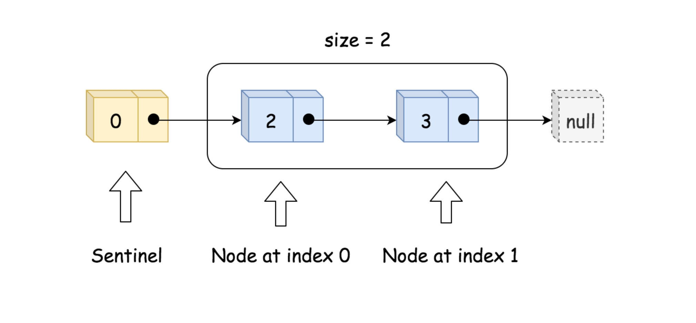
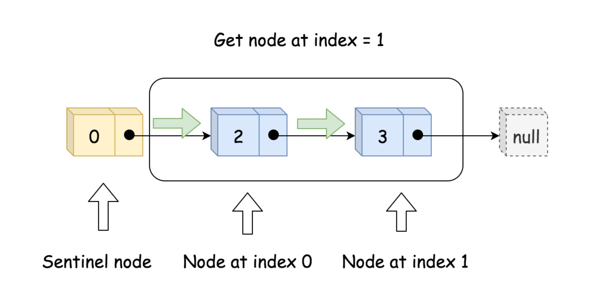
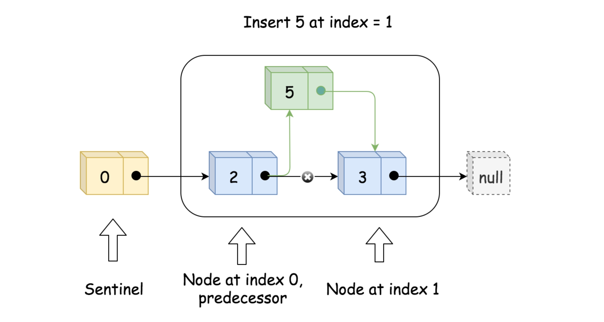
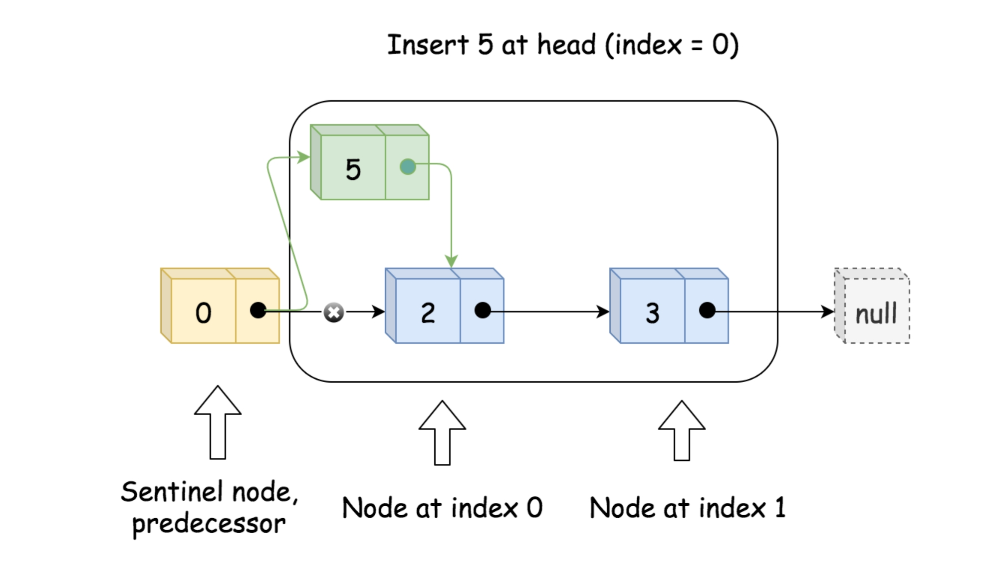
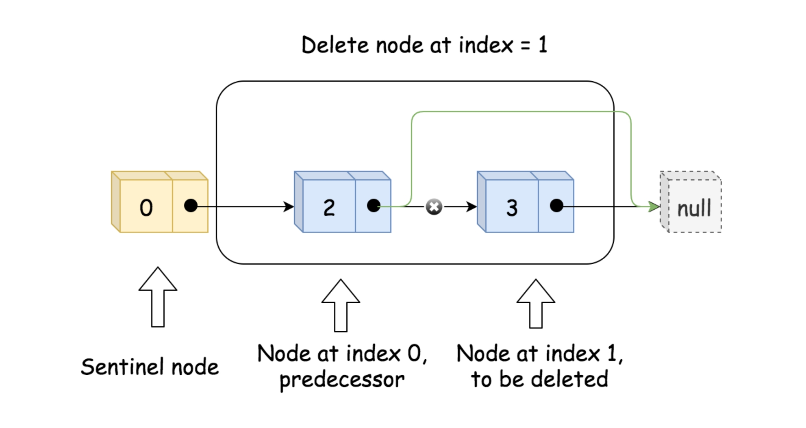
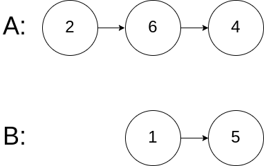
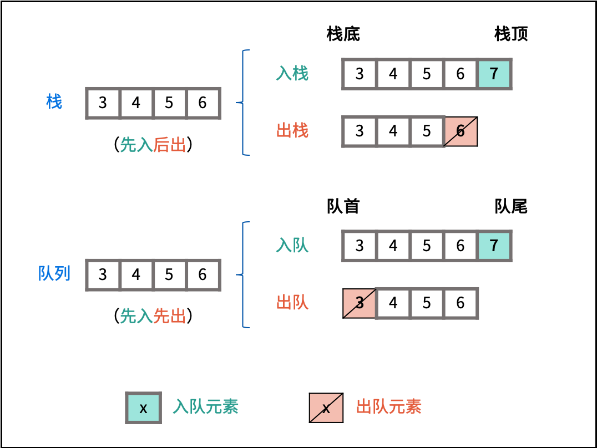

# 代码随想录

# 707.设计链表

[力扣题目链接(opens new window)](https://leetcode.cn/problems/design-linked-list/)

题意：

在链表类中实现这些功能：

- get(index)：获取链表中第 index 个节点的值。如果索引无效，则返回-1。
- addAtHead(val)：在链表的第一个元素之前添加一个值为 val 的节点。插入后，新节点将成为链表的第一个节点。
- addAtTail(val)：将值为 val 的节点追加到链表的最后一个元素。
- addAtIndex(index,val)：在链表中的第 index 个节点之前添加值为 val 的节点。如果 index 等于链表的长度，则该节点将附加到链表的末尾。如果 index 大于链表长度，则不会插入节点。如果index小于0，则在头部插入节点。
- deleteAtIndex(index)：如果索引 index 有效，则删除链表中的第 index 个节点。

#### ****方法一：单向链表\****

**思路**

实现单向链表，即每个节点仅存储本身的值和后继节点。除此之外，我们还需要一个哨兵（sentinel）节点作为头节点，和一个size参数保存有效节点数。如下图所示。


初始化时，只需创建头节点 head 和 size即可。实现 get**(**index) 时，先判断有效性，再通过循环来找到对应的节点的值。如下图所示。


实现addAtIndex(index, val)时，如果index是有效值，则需要找到原来下标为 index的节点的前驱节点 pred，并创建新节点 to_add，将to_add 的后继节点设为 pred 的后继节点，将 pred 的后继节点更新为 to_add，这样就将 to_add 插入到了链表中。最后需要更新 size。这样的操作对于 index=0 也成立，如以下两张图所示。



实现 addAtHead(val)和 addAtTail(val) 时，可以借助 addAtIndex(index, val)来实现。

实现 deleteAtIndex(index)，先判断参数有效性。然后找到下标为 index 的节点的前驱节点 pred，通过将 pred 的后继节点更新为 pred 的后继节点的后继节点，来达到删除节点的效果。同时也要更新 size。如下图所示。


 

# [02.07. 链表相交](https://leetcode.cn/problems/intersection-of-two-linked-lists-lcci/)

给你两个单链表的头节点 `headA` 和 `headB` ，请你找出并返回两个单链表相交的起始节点。如果两个链表没有交点，返回 `null` 。

图示两个链表在节点 `c1` 开始相交**：**

[](https://assets.leetcode-cn.com/aliyun-lc-upload/uploads/2018/12/14/160_statement.png)

题目数据 **保证** 整个链式结构中不存在环。

**注意**，函数返回结果后，链表必须 **保持其原始结构** 。

 

**示例 1：**

[](https://assets.leetcode.com/uploads/2018/12/13/160_example_1.png)

```
输入：intersectVal = 8, listA = [4,1,8,4,5], listB = [5,0,1,8,4,5], skipA = 2, skipB = 3
输出：Intersected at '8'
解释：相交节点的值为 8 （注意，如果两个链表相交则不能为 0）。
从各自的表头开始算起，链表 A 为 [4,1,8,4,5]，链表 B 为 [5,0,1,8,4,5]。
在 A 中，相交节点前有 2 个节点；在 B 中，相交节点前有 3 个节点。
```

**示例 2：**

[](https://assets.leetcode.com/uploads/2018/12/13/160_example_2.png)

```
输入：intersectVal = 2, listA = [0,9,1,2,4], listB = [3,2,4], skipA = 3, skipB = 1
输出：Intersected at '2'
解释：相交节点的值为 2 （注意，如果两个链表相交则不能为 0）。
从各自的表头开始算起，链表 A 为 [0,9,1,2,4]，链表 B 为 [3,2,4]。
在 A 中，相交节点前有 3 个节点；在 B 中，相交节点前有 1 个节点。
```

**示例 3：**

[](https://assets.leetcode.com/uploads/2018/12/13/160_example_3.png)

```
输入：intersectVal = 0, listA = [2,6,4], listB = [1,5], skipA = 3, skipB = 2
输出：null
解释：从各自的表头开始算起，链表 A 为 [2,6,4]，链表 B 为 [1,5]。
由于这两个链表不相交，所以 intersectVal 必须为 0，而 skipA 和 skipB 可以是任意值。
这两个链表不相交，因此返回 null 。
```

 

**提示：**

- `listA` 中节点数目为 `m`
- `listB` 中节点数目为 `n`
- `0 <= m, n <= 3 * 104`
- `1 <= Node.val <= 105`
- `0 <= skipA <= m`
- `0 <= skipB <= n`
- 如果 `listA` 和 `listB` 没有交点，`intersectVal` 为 `0`
- 如果 `listA` 和 `listB` 有交点，`intersectVal == listA[skipA + 1] == listB[skipB + 1]`


# 232.用栈实现队列

[力扣题目链接(opens new window)](https://leetcode.cn/problems/implement-queue-using-stacks/)

使用栈实现队列的下列操作：

push(x) -- 将一个元素放入队列的尾部。
pop() -- 从队列首部移除元素。
peek() -- 返回队列首部的元素。
empty() -- 返回队列是否为空。

示例:

```cpp
MyQueue queue = new MyQueue();
queue.push(1);
queue.push(2);
queue.peek();  // 返回 1
queue.pop();   // 返回 1
queue.empty(); // 返回 false
```

说明:

- 你只能使用标准的栈操作 -- 也就是只有 push to top, peek/pop from top, size, 和 is empty 操作是合法的。
- 你所使用的语言也许不支持栈。你可以使用 list 或者 deque（双端队列）来模拟一个栈，只要是标准的栈操作即可。
- 假设所有操作都是有效的 （例如，一个空的队列不会调用 pop 或者 peek 操作）。

## [#](https://www.programmercarl.com/0232.用栈实现队列.html#思路)思路

这是一道模拟题，不涉及到具体算法，考察的就是对栈和队列的掌握程度。

使用栈来模式队列的行为，如果仅仅用一个栈，是一定不行的，所以需要两个栈**一个输入栈，一个输出栈**，这里要注意输入栈和输出栈的关系。

下面动画模拟以下队列的执行过程：

执行语句：
queue.push(1);
queue.push(2);
queue.pop(); **注意此时的输出栈的操作**
queue.push(3);
queue.push(4);
queue.pop();
queue.pop();**注意此时的输出栈的操作**
queue.pop();
queue.empty();


在push数据的时候，只要数据放进输入栈就好，**但在pop的时候，操作就复杂一些，输出栈如果为空，就把进栈数据全部导入进来（注意是全部导入）**，再从出栈弹出数据，如果输出栈不为空，则直接从出栈弹出数据就可以了。

最后如何判断队列为空呢？**如果进栈和出栈都为空的话，说明模拟的队列为空了。**

在代码实现的时候，会发现pop() 和 peek()两个函数功能类似，代码实现上也是类似的，可以思考一下如何把代码抽象一下。

## 用栈实现队列（清晰图解）


解题思路：

栈实现队列的出队操作效率低下：栈底元素（对应队首元素）无法直接删除，需要将上方所有元素出栈。

**两个栈可实现将列表倒序**：设有含三个元素的栈 `A = [1,2,3]` 和空栈 `B = []` 。若循环执行 `A` 元素出栈并添加入栈 `B` ，直到栈 `A` 为空，则 `A = []` , `B = [3,2,1]` ，即栈 `B` 元素为栈 `A` 元素倒序。

**利用栈 `B` 删除队首元素**：倒序后，`B` 执行出栈则相当于删除了 `A` 的栈底元素，即对应队首元素。



因此，可以设计栈 `A` 用于加入队尾操作，栈 `B` 用于将元素倒序，从而实现删除队首元素。

### 函数设计：

1. **加入队尾 `push()` ：** 将数字 `val` 加入栈 `A` 即可。
2. 获取队首元素 `peek()` ：
   1. **当栈 `B` 不为空：** `B`中仍有已完成倒序的元素，因此直接返回 `B` 的栈顶元素。
   2. **否则，当 `A` 为空：** 即两个栈都为空，无元素，因此返回 -1 。
   3. **否则：** 将栈 `A` 元素全部转移至栈 `B` 中，实现元素倒序，并返回栈 `B` 的栈顶元素。
3. 弹出队首元素 `pop()` ：
   1. 执行 `peek()` ，获取队首元素。
   2. 弹出 `B` 的栈顶元素。
4. **队列判空 `empty()` ：** 当栈 `A` 和 `B` 都为空时，队列为空。

### 复杂度分析：
以下分析仅满足添加 N 个元素并删除 N个元素，即栈初始和结束状态下都为空的情况。

1. **时间复杂度：** push(), empty() 函数的时间复杂度为 O(1) ；peek() , pop() 函数在 N 次队首元素删除操作中总共需完成 N 个元素的倒序，均摊时间复杂度为 O(1)。
2. **空间复杂度 O(N) ：** 最差情况下，栈 A 和 B 共保存 NNN 个元素。


